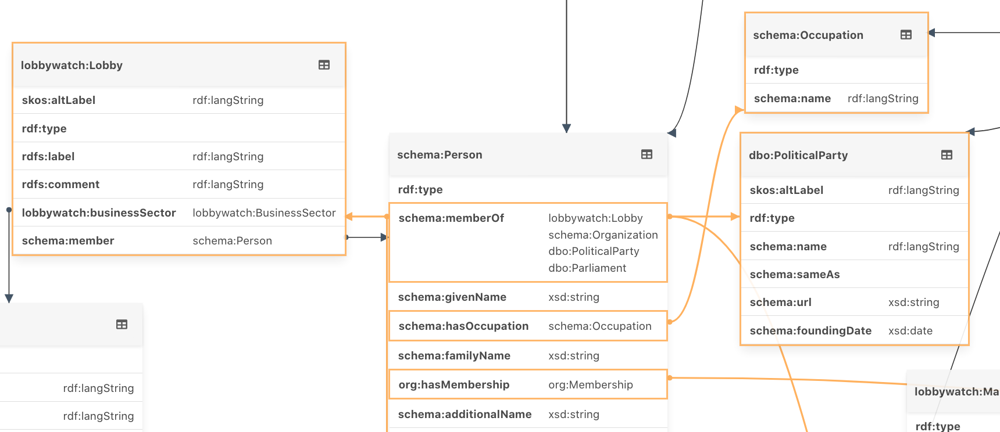

# SPEX - SPARQL Endpoint Explorer

SPEX introspects data residing in SPARQL endpoints. It is using the
self-describing nature of RDF based data to give you a better
understanding of its schema.

Once the schema is available, SPEX can be used to browse instances of
this data and follow links to other data.

SPEX can be very useful to explore and introspect a formerly unknown
dataset, but it is not a generic graph-browser. Its purpose is to give a
better understanding of the schema and show basic relations between
data. For further graph exploration, we recommend tools like [Ontodia](http://ontodia.org/).

## Usage

You can try a [live instance of SPEX](https://zazuko.github.io/endpoint-explorer/). 

SPEX is using SPARQL to see what data is available. As a minimal entry
point, a SPARQL endpoint has to be provided. Once the SPARQL endpoint is
configured, SPEX can introspect data. It can do that either on the
default graph, or a specific named graph. Use the dropdown of the
named-graphs to limit it, if available.

SPEX executes generic SPARQL queries to understand the structure of the
data. It assumes that URIs have at least one RDF class assigned and
group entities that are part of the same class. For those classes, it
will query the distinct properties, including optional ones. It also
introspects the datatypes of properties and how they link to other
concepts. For example a [schema:Person](https://schema.org/Person) that links to a
[schema:PostalAddress](https://schema.org/PostalAddress) via the property [schema:address](https://schema.org/address).

This information is then visualized. If one hovers over a link or a
property that points to another class, all involved classes & properties
are highlighted. If one hovers over the class, all outgoing connections
are highlighted. Use the browse-button to explore specific instances of
a particular class.



Depending on the size of the dataset, introspection can be very costly.
For that reason, SPEX first checks if there are SHACL shapes available
on the particular endpoint/graph. If it finds a SHACL shape, it will use
this instead and not execute a SPARQL query.

You can download the auto-generated shape as a starting point in case
you want to provide shapes on the endpoint.

## Limitations

Introspection and auto-generation of SHACL shapes might give strange
results, in particular:

* when more than one class is assigned to instances of data
* when there are many different datasets with the same class but different properties. For example, a dataset containing multiple RDF Cubes with different dimensions.

In this case, it is best to provide pre-defined SHACL shapes instead.
Inferring the correct structure automatically will require more work
than the generic queries used by SPEX.

The URL of the shape is work in progress, see [this issue](https://github.com/zazuko/endpoint-explorer/issues/25) for more information.

SPEX tries to find a good layout to render the different tables. This is not easy and there is surely room for improvement.

## Accessing an unencrypted (http) SPARQL endpoint

SPEX is a web application that runs in a browser window. This will cause
problems if a SPARQL endpoint is not available on https and SPEX is
served on https only. See 
[Mixed Content](https://developers.google.com/web/fundamentals/security/prevent-mixed-content/fixing-mixed-content)
restrictions for more information about why.

A common error in that scenario is `TypeError: Network request failed`
when trying to access an http SPARQL endpoint. The only exception to
this rule is your local machine, you will always be able to access an
http only SPARQL endpoint on localhost.

The only way to fix this is to either implement a SPARQL proxy or to
serve SPEX on an http resource.

## SPEX as a local Application

SPEX can be installed as a so-called [progressive web application](https://en.wikipedia.org/wiki/Progressive_web_application)
(PWA). If you follow the [guide at MDN](https://developer.mozilla.org/en-US/docs/Web/Progressive_web_apps/Developer_guide/Installing),
SPEX will be available on your desktop computer like any other application.

Note that right now the PWA [does not update](https://stackoverflow.com/questions/49739438/when-and-how-does-a-pwa-update-itself) itself.

## Extending SPEX

SPEX is developed by Zazuko and released as Open Source Software under
the MIT license.

We use SPEX on a daily base to work with datasets. There are many ideas
of what could and should be added to SPEX. Check out the GitHub issues
to see what could be done next.

There are three ways to get new features implemented:

1. Implement it on your own and submit a pull-request to this repository.  
2. Pay us for a specific feature. Get [in contact with us](mailto:info@zazuko.com?subject=SPEX) by email to get a quote.
3. Wait for 1 or 2 to happen.

## Support

Zazuko provides commercial support for SPEX, get in [contact with us](mailto:info@zazuko.com?subject=SPEX) for
more information.

## Development Project setup

```
npm install
```

### Compiles and hot-reloads for development
```
npm run serve
```

### Compiles and minifies for production
```
npm run build
```

### Run your unit tests
```
npm run test:unit
```

### Lints and fixes files
```
npm run lint
```

### Customize configuration
See [Configuration Reference](https://cli.vuejs.org/config/).
